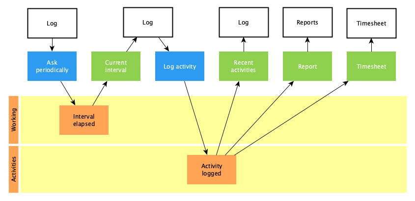
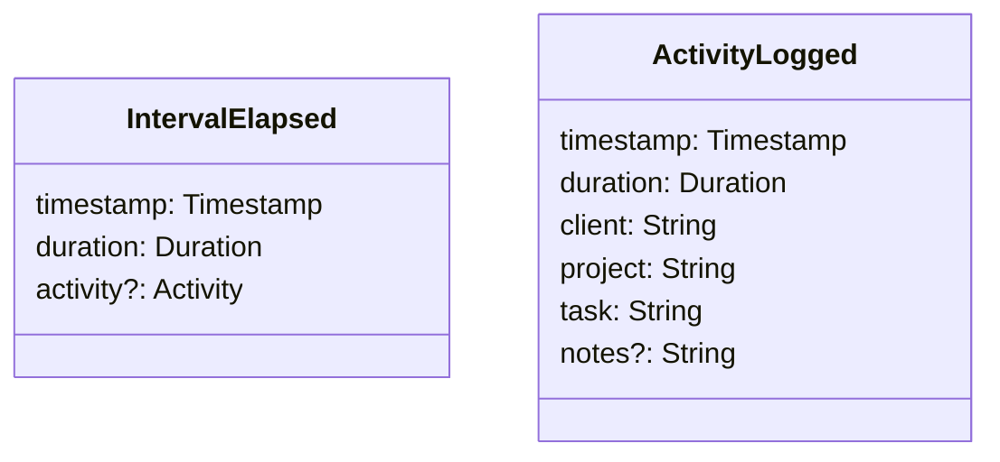

# Activity Sampling

Periodically asks the user about their current activity and logs it for
analysis.

## Domain

### Ask periodically

- [x] Start countdown with a given interval
- [ ] Start countdown with the default interval when the application starts

### Current Interval

- [x] Notify user when an interval is elapsed

### Log Activity

- [x] Log the activity with client, project, task and optional notes
- [x] Select an activity from recent activities
- [x] Select last activity when the application starts

### Recent Activities

- [x] Return last activity
- [x] Group activities by working days for the last 30 days
- [x] Summarize hours worked today, yesterday, this week and this month

### Time Report

- [ ] Summarize hours worked for clients
- [ ] Summarize hours worked on projects
- [ ] Summarize hours worked on tasks
- [ ] Summarize hours worked per day
- [ ] Summarize hours worked per week
- [ ] Summarize hours worked per month
- [ ] Summarize hours worked per year
- [ ] Summarize hours worked overall
- [ ] Summarize the total hours worked

### Timesheet

- [x] Summarize hours worked on tasks
- [x] Summarize hours worked per day
- [x] Summarize hours worked per week
- [x] Summarize hours worked per month
- [x] Summarize the total hours worked
- [x] Compare with capacity
- [ ] Take holidays into account
- [ ] Take vacation into account

## Events

## Architecture

[Architecture Communication Canvas](https://html-preview.github.io/?url=https://github.com/falkoschumann/activity-sampling-ts/blob/main/doc/acc.html)
