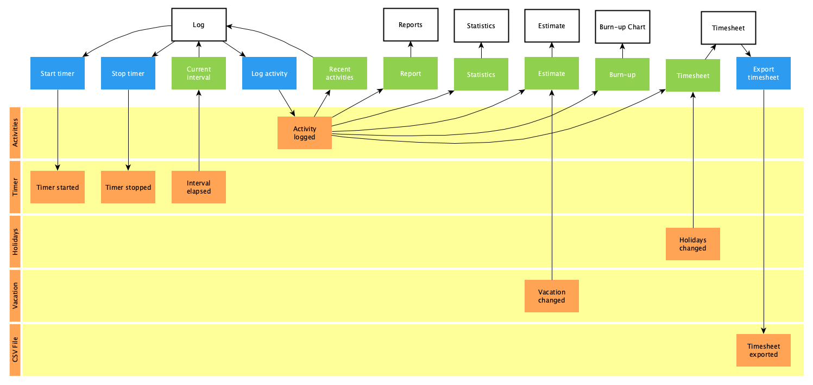

# Activity Sampling

Periodically asks the user about their current activity and logs it for
analysis.

## Domain

Stories marked with ❗are planned for the next release.

### Start Timer

- [ ] Start the timer with the default interval when the application starts
- [x] Start the timer with a given interval

### Stop Timer

- [x] Stop the timer

### Current Interval

- [x] Notify the user when an interval is elapsed

### Log Activity

- [x] Log the activity with a client, a project, a task and with optional notes
      or category
- [ ] Log activity with first and last name of team member

### Recent Activities

- [x] Group activities by working days for the last 30 days
- [x] Summarize hours worked today, yesterday, this week and this month

### Report

- [x] Summarize hours worked for clients
- [x] Summarize hours worked on projects
- [x] Summarize hours worked on tasks
- [x] Summarize hours worked on categories
- [ ] Summarize hours worked for team members
- [x] Summarize the total hours worked
- [x] Summarize in a period
- [ ] Optionally aggregate clients of same project
- [ ] Filter projects by client
- [ ] Optionally aggregate categories of same task
- [ ] Filter tasks by client, project or category

### Statistics

- [x] Create histogram for hours worked on tasks
- [x] Create histogram for cycle times
- [ ] Create histogram for throughput per period
- [ ] Create histogram for WIP per period
- [x] Determine median for hours worked on tasks
- [x] Determine median for cycle times
- [ ] Determine median for throughput per period
- [ ] Determine median for WIP per period
- [ ] Exclude tasks not suitable for statistics
- [x] Filter statistic data by category

### Estimate

- [x] Estimate tasks with cycle times
- [ ] Estimate tasks with throughput
- [x] Filter tasks by category

### Burn-Up

- [ ] ❗Determine tasks done over time
- [ ] ❗Filter tasks in a period
- [ ] ❗Filter tasks by category

### Cumulative Flow

- [ ] Determine tasks done over time
- [ ] Determine tasks work in progress over time
- [ ] Determine cycle time
- [ ] Determine throughput and WIP
- [ ] Determine WIP
- [ ] Filter tasks in a period
- [ ] Filter tasks by category

### Timesheet

- [x] Summarize hours worked on tasks
- [x] Summarize the total hours worked
- [x] Summarize in a period
- [x] Compare with capacity
- [x] Take holidays into account
- [x] Take vacation into account

### Export Timesheet

- [ ] ❗Export timesheet in Harvest format
- [ ] ❗Export only tasks of a specific client
- [ ] ❗Export only tasks of a specific project
- [ ] ❗Export only tasks in a specific period
- [ ] Export only tasks of a specific category

## Architecture

[Architecture Communication Canvas](https://html-preview.github.io/?url=https://github.com/falkoschumann/activity-sampling/blob/main/doc/acc.html)
