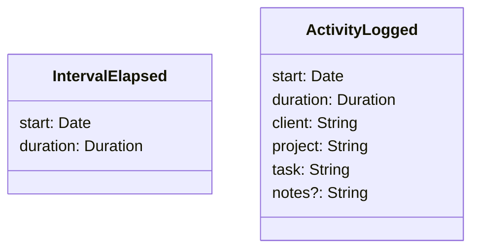

# Activity Sampling

Periodically asks the user about their current activity and logs it for
analysis.

## Domain

### Ask periodically

- [x] Starts countdown with given interval.
- [ ] Starts countdown with the default interval when the application starts.

### Current Interval

- [x] Notifies user when interval is elapsed.

### Log Activity

- [x] Logs the activity with client, project, task and optional notes.
- [x] Selects an activity from recent activities.
- [x] Selects last activity when the application starts.

### Recent Activities

- [x] Groups activities by working days for the last 30 days.
- [x] Summarizes hours worked today, yesterday, this week and this month.

### Time Report

- [ ] Summarizes hours worked for clients.
- [ ] Summarizes hours worked on projects.
- [ ] Summarizes hours worked on tasks.
- [ ] Summarizes hours worked per day.
- [ ] Summarizes hours worked per week.
- [ ] Summarizes hours worked per month.
- [ ] Summarizes hours worked per year.
- [ ] Summarizes the total hours worked.

### Timesheet

- [ ] Summarize hours worked on tasks.
- [ ] Summarizes hours worked on projects per day.
- [ ] Summarizes hours worked on projects per week.
- [ ] Summarizes hours worked on projects per month.
- [ ] Compares with capacity.
- [ ] Takes holidays into account.
- [ ] Takes vacation into account.

## Events

## Architecture

[Architecture Communication Canvas](https://html-preview.github.io/?url=https://github.com/falkoschumann/activity-sampling-ts/blob/main/doc/acc.html)
