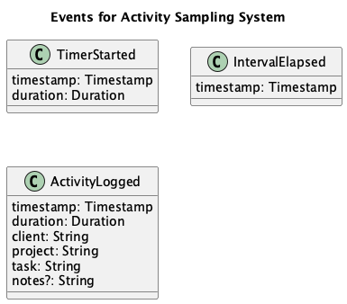

# Activity Sampling

Periodically asks the user about their current activity and logs it for
analysis.

## Domain

### Ask periodically

- Start the timer with a given interval
- Start the timer with the default interval when the application starts

### Current Interval

- Notify the user when an interval is elapsed

### Log Activity

- Log the activity with a client, a project, a task and optional notes
- Select an activity from recent activities
- Select the last activity when the application starts

### Recent Activities

- Return last activity
- Group activities by working days for the last 30 days
- Summarize hours worked today, yesterday, this week and this month

### Reports

- Summarize hours worked for clients
- Summarize hours worked on projects
- Summarize hours worked on tasks
- Summarize hours worked per day
- Summarize hours worked per week
- Summarize hours worked per month
- Summarize hours worked per year
- Summarize hours worked all the time
- Summarize hours worked in a custom period
- Summarize the total hours worked

### Timesheet

- Summarize hours worked on tasks
- Summarize hours worked per day
- Summarize hours worked per week
- Summarize hours worked per month
- Summarize the total hours worked
- Compare with capacity
- Take holidays into account
- Take vacation into account

## Events

## Architecture

[Architecture Communication Canvas](https://html-preview.github.io/?url=https://github.com/falkoschumann/activity-sampling/blob/main/doc/acc.html)
